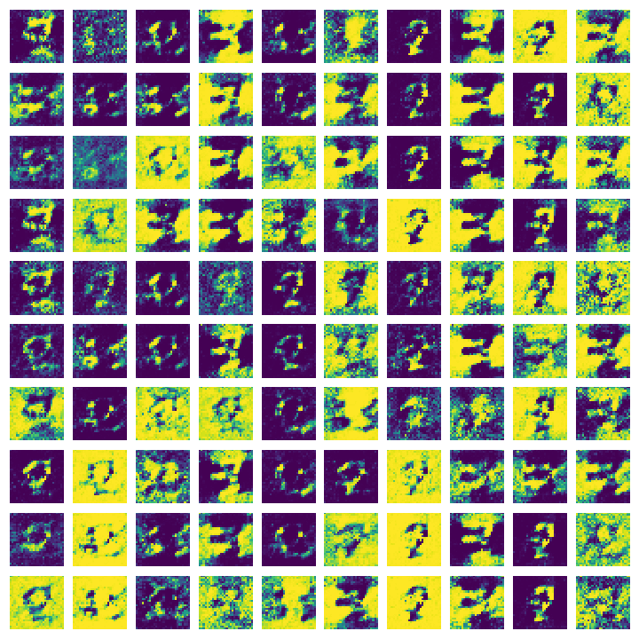

# MNIST GAN

This project is a Generative Adversarial Network (GAN) to simulate MNIST digits. The aim is to create a model that mimics handwritten digits.

## Usage

The first code (mnistGan.py) is a basic GAN trying to simulate any digit.

The second code (number_generation.py) allows to train a model to write each number specifically, so that you can have an algorithm creating digits as if written by hand.

## Results

  